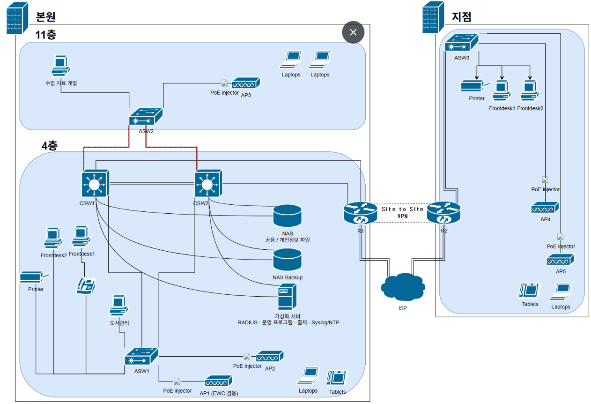
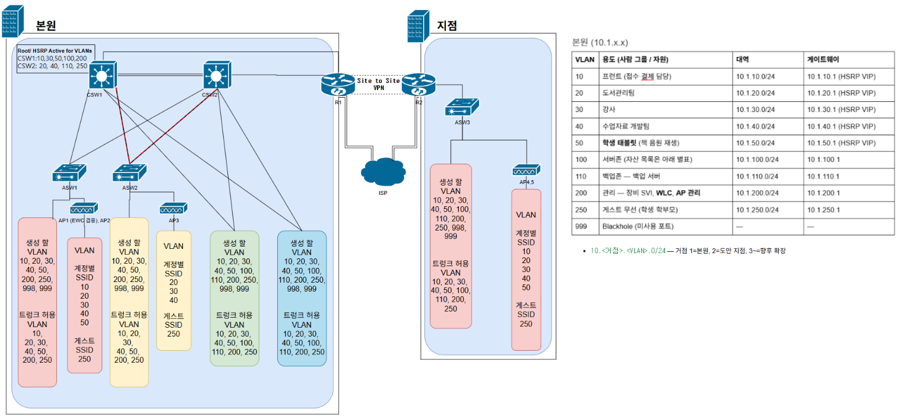

# smb-academy-branch-network
Network design for a two-site language academy — role-based segmentation and access control, built from the owner's real operational requirements.

## 프로젝트 개요
이전에 일하던 영어 도서관 겸 어학원에서 운영자의 고충을 들어 프로젝트를 시작하게 됐다. 운영자는 학원에서 쓰이는 모든 자료(학생 정보, 결제 내역, 수업 자료, 도서 DB, 스케줄 등)가 한 구글 드라이브에 저장되어 있고 모든 직원들이 그 어카운트를 사용하는 것에 불안감을 느꼈다. 실제로 과거 퇴사자가 모든 자료를 삭제한 사고도 있었다. 구글 본사에 전화해 일부 복구가 가능했지만 금전적인 손해를 입었다. 

운영자는 학원 운영 프로그램(학생 관리, 도서·수업 자료 관리, 결제)을 자체적으로 두고 싶어했고 직원들이 직무에 따른 접근 권한을 가지길 원한다. 1~2년 내 지점을 열 예정이며 그때는 구글 드라이브 대신 자체 인프라로 운영하길 원한다. 

이 프로젝트는 Packet Tracer를 사용해 본원과 지점을 연결하는 인프라를 설계, 구현, 장애 주입 검증으로 구성된다. 설계 단계를 마쳤고 현재 구현 단계에 있다.

## 토폴로지 이미지
물리 설계도

논리 설계도

Packet Tracer 물리 설계도
[예정]

## 요구 사항
| # | 요구사항 (고객 언어 그대로) |
|---|---|
| 1 | 직원이 자신의 직무에 필요한 자료만 볼 수 있을 것  (프런트 데스크 / 도서 관리팀 / 강사 / 수업 자료 개발팀)
| 2 | 전체 자료가 한번에 삭제되지 않게 하고 활동 내용을 확인할 수 있을 것
| 3 | 학원 운영 프로그램을 본원과 지점, 그리고 추후에 생길 지점에서도 사용할 수 있을 것
| 4 | 인터넷이 끊겨도 수업과 학원 운영에 영향이 가지 않을 것
| 5 | 장비나 케이블 하나에 문제가 생겨도 수업과 학원 운영에 영향이 가지 않을 것
| 6 | 새로운 노트북이나 유선·무선기기를 사용해도 로그인을 하면 학원 네트워크를 사용할 수 있을 것
| 7 | 게스트용 와이파이로 학원 내부 자료를 볼 수 없을 것
| 8 | 지점이 늘어날 것을 전제로 할 것

**한계** 
1. |3| 학원 운영 프로그램은 개발자의 영역.
2. |6| 학원에서 직원이 개인 기기를 사용하는 것은 학원 정책으로 금지. 
개인 기기 사용을 기술적으로 금지하기 위해선 EAP-TLS을 사용해야하는데 인증서를 관리할 수 있는 규모가 안되고 비용이 급증.
3. |4| 결제는 인터넷 통신이 필요해 장애 시 불가능.

**PT에서 유선 dot1x 지원 - 검증 예정

## 사용 기술
VLAN, 802.1Q, RPVST+, SVI, ROAS, EtherChannel(LACP), OSPF, Floating static route, HSRPv2, Extended ACL, NAT/PAT, 
SYSLOG, NTP, DHCP, DNS, Port security, DHCP snooping, DAI, site-to-site VPN, RADIUS + 802.1X, 
WLC, CAPWAP, WPA2-Enterprise with PEAP, SSID-VLAN mapping, WI-FI

**pt 한계와 대응**
1. MAB(MAC Authentication Bypass)
2. NAS 논리적 분리(vlan tagging | 랜포트 2개 이상 | 가상화) 
    - PT에서는 서버 두 대를 놓아서 분리함. 실제로는 위 괄호 안에 있는 기술을 사용해 논리적 분리.
3. VTP v3 지원 X. VTP v2 사용

## 주요 설계 결정 (수정 필요)

**주소 설계**
10.[거점].[vlan].0/24
[거점] 본원: 1 지점:2 거점이 늘어나면 같은 규칙으로 생성
[vlan] 세번째 옥텟에 vlan이 들어가므로 vlan id는 1~255 범위 안에서 지정한다.

**인증과 권한**
직원용 SSID 하나에 802.1X를 적용하고 RADIUS가 계정을 확인해 직무별 VLAN을 할당한다.
접속 매체가 아니라 계정이 권한을 정하므로 유선과 무선에 같은 정책이 적용된다.
퇴사자는 계정 하나를 비활성화하면 전 거점에서 차단된다.

**자료 배치**
개인정보가 포함된 자료는 별도 IP로 분리했다.
ACL은 IP와 포트만 보기 때문에 같은 서버에 둔 자료는 네트워크 계층에서 구분할 수 없다.
폴더 단위 권한은 파일 서버가 담당한다.

**이중화 범위**
본원만 이중화하고 지점은 단일 구성으로 두었다.
본원이 전 지점의 서버를 호스팅하므로 본원이 멈추면 지점 업무도 함께 멈추기 때문이다.
회선도 같은 이유로 양 거점에 보조 회선을 두었다.

**주소 정리 링크**
https://docs.google.com/spreadsheets/d/1pn82nBEWZhSKM8KyXc3gqAoe9HLLubGO3G07kWPLq4g/edit?usp=sharing

## 검증 결과
(아직 테이블만 추후에 채울 예정)

| # | 테스트 | 방법 | 기대 결과 | 측정값 |
|---|---|---|---|---|
| 1 | STP 절체 | Root Bridge 링크 다운 | 대체 경로로 절체, 통신 유지 | ○초 |
| 2 | EtherChannel | 번들 중 1개 링크 다운 | 무중단, 대역폭만 감소 | 무중단 여부 |
| 3 | HSRP | Active 라우터 다운 | Standby 승격 | ○초 |
| 4 | WAN 절체 | 주회선 다운 | 백업 경로로 전환 | ○초 |
| 5 | ACL — 직무 분리 ① | 강사 VLAN → 결제 서버(`.12`) | 차단 | — |
| 5-2 | ACL — 직무 분리 ② | 수업자료 개발 VLAN → 개인정보 파일 서버(`.14`) | 차단 | — |
| 5-3 | ACL — 공용 자료 | 전 직무 VLAN → 공용 파일 서버(`.13`) | 전부 허용 | — |
| 6 | ACL — 백업존 | 서버존 → 백업 서버 연결 시도 | 차단 (pull 방향만 허용) | — |
| 7 | 무선 — 게스트 격리 | 게스트 SSID → 서버존 / 인터넷 | 서버존 차단, 인터넷 허용 | — |
| 8 | 무선 — 직원 연결 | 강사 계정으로 직원 SSID 접속 | VLAN 30에서 DHCP 수신 | — |
| 9 | 무선 — 동적 VLAN | 도서관리 계정으로 같은 SSID 접속 | VLAN 20에서 DHCP 수신 | — |
| 10 | Syslog·NTP | 포트 shutdown 후 로그 확인 | 서버에 정확한 시각으로 기록 | — |
| 11 | 802.1X | 미인가 계정 인증 시도 | 차단 | — |

## 문서 링크
- [요구사항정의서](./docs/01_요구사항정의서.md)
- [주소설계](./docs/02_주소설계.md)
- [토폴로지](./docs/03_토폴로지.md)
- [접근통제설계](./docs/04_접근통제설계.md)
- [검증결과](./docs/05_검증결과.md)
- [트러블슈팅](./docs/06_트러블슈팅.md)
